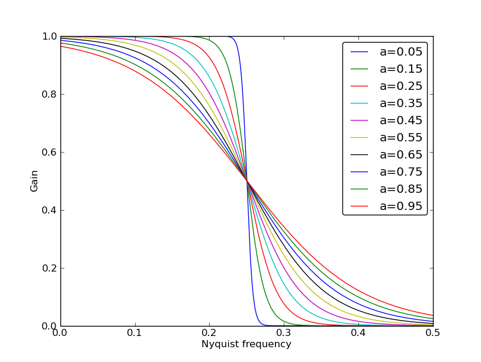

Filter
======

filter_build_1d_Butterworth_lp
------------------------------

Same function as filter_build_3d_Butterworth_lp, but in 1d

filter_build_1d_Gaussian
------------------------

Same function as filter_build_3d_Gaussian, but in 1d

filter_build_1d_Metz
--------------------

Same function as filter_build_3d_Metz, but in 1d

filter_build_1d_tanh_lp
-----------------------

Same function as filter_build_3d_tanh_lp, but in 1d

filter_build_2d_Butterworth_lp
------------------------------

Same function as filter_build_3d_Butterworth_lp, but in 2d

filter_build_2d_Gaussian
------------------------

Same function as filter_build_3d_Gaussian, but in 2d

filter_build_2d_Metz
--------------------

Same function as filter_build_3d_Metz, but in 2d

filter_build_2d_tanh_lp
-----------------------

Same function as filter_build_3d_tanh_lp, but in 2d

filter_build_3d_Butterworth_lp
------------------------------

H = **filter_build_3d_Butterworth_lp** (size, N, fc)

*Build a 3D lowpass Butterworth filter*

**Parameters**

``size`` Size of the edge of the 3D transfert function.

``N`` Order of the filter. 

``fc`` Cut-off frequency.

**Returns**

``H`` Numpy array of 3 dimensions *(size, size, size)*, which contains coefficients of the transfert function.

**Notes**

The transfert function is defined with a symmetry in order to be applied directly to the Fourrier space.

**Examples**

::

	>>> H = filter_build_3d_Butterworth_lp(141, 2, 0.2)

filter_build_3d_Gaussian
------------------------

H = **filter_build_3d_Gaussian** (size, fc)

*Build a 3D Gaussian filter*

**Parameters**

``size`` Size of the edge of the 3D transfert function.

``fc`` Cut-off frequency, equivalent to the sigma value.

**Returns**

``H`` Numpy array of 3 dimensions *(size, size, size)*, which contains coefficients of the transfert function.

**Notes**

The transfert function is defined with a symmetry in order to be applied directly to the Fourrier space.

**Examples**

::

	>>> H = filter_build_3d_Gaussian(141, 0.2)
	

filter_build_3d_Metz
--------------------

H = **filter_build_3d_Metz** (size, N, fc)

*Build a 3D Metz filter*

**Parameters**

``size`` Size of the edge of the 3D transfert function.

``N`` Order of the filter. If *N=0* the filter is equivalent to a Gaussian filter. More *N>0* more the filter has gain in medium frequencies.

``fc`` Cut-off frequency, equivalent to sigma of the Gaussian filter.

**Returns**

``H`` Numpy array of 3 dimensions *(size, size, size)*, which contains coefficients of the transfert function.

**Notes**

The transfert function is defined with a symmetry in order to be applied directly to the Fourrier space.

**Examples**

::

	>>> H = filter_build_3d_Metz(141, 2, 0.2)

filter_build_3d_tanh_lp
-----------------------

H = **filter_build_3d_tanh_lp** (size, a, fc)

*Build a 3D lowpass hyperbolic tangent filter*

**Parameters**

``size`` Size of the edge of the 3D transfert function.

``a`` Smooth factor of the slope.

``fc`` Cut-off frequency.

**Returns**

``H`` Numpy array of 3 dimensions *(size, size, size)*, which contains coefficients of the transfert function.

**Notes**

The transfert function is defined with a symmetry in order to be applied directly to the Fourrier space. In order to know which value of smoothness apply to your filter, refert the figure above where some values of *a* was plotted.

**Examples**

::

	>>> H = filter_build_3d_tanh_lp(141, 0.1, 0.2)

	
filter_pad_3d_cuda
------------------

Hpad = **filter_pad_3d_cuda** (H)

*Shift, pad and crop a 3d filter in order to be used by a convolution perform by cuda (cufft). This function well prepare the filter according the FFT format provide by cuda (non redundant coefficients).*

**Parameters**

``H`` 3D transfert function, must be a Numpy array.

**Returns**

``Hpad`` Numpy array of 3 dimensions. 

**Notes**

**Examples**

::

	>>> H = filter_build_3d_Metz(141, 2, 0.2)
	>>> Hpad = filter_pad_3d_cuda(H)

